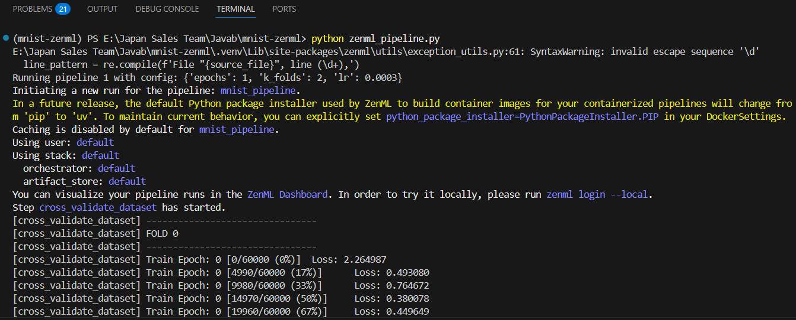
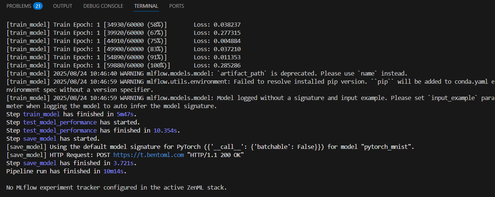
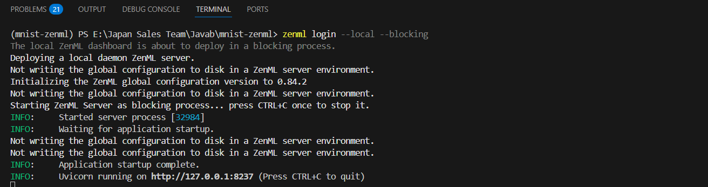
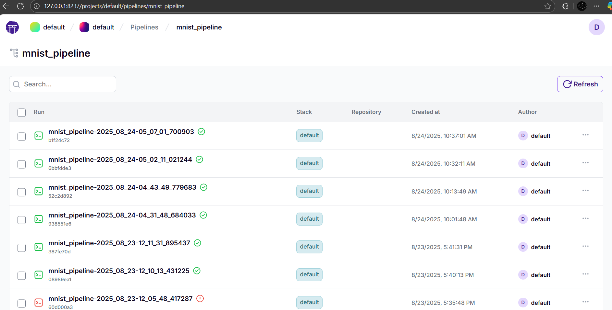
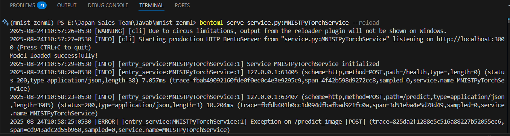
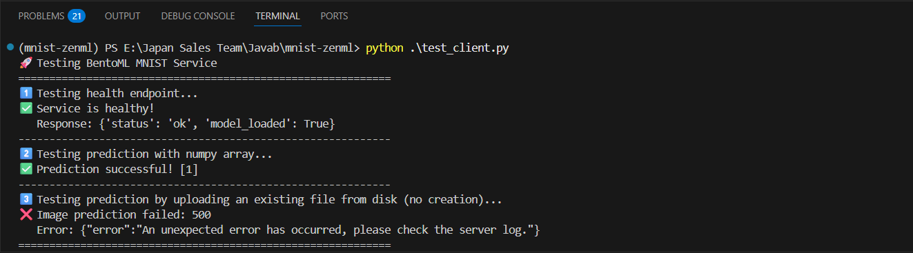

# MNIST ZenML BentoML Pipeline

This repository demonstrates an end-to-end machine learning pipeline for training, tracking, and deploying a digit classification model using the MNIST dataset. The pipeline integrates ZenML for orchestration, MLflow for experiment tracking, PyTorch for model training, and BentoML for model deployment.

This project is based on top of [MNIST example project](https://github.com/bentoml/gallery/tree/73119b5602b6285678058910fcd53f91a612dccd/pytorch) from BentoML.


## 📦 Project Structure

```
mnist-zenml-bentoml-pipeline/
├── datasource.py          # Data loading and preprocessing
├── model.py              # Model architecture definition
├── train.py              # Model training script
├── zenml_pipeline.py     # ZenML pipeline definition
├── service.py            # BentoML service for model serving
├── test_client.py        # Client script for testing the deployed model
├── requirements.txt      # Python dependencies
├── pyproject.toml        # Project metadata
├── .gitignore            # Git ignore file
├── LICENSE               # Project license
└── README.md             # Project documentation
```

## 🚀 Getting Started

### Prerequisites

* Python 3.10+
* [ZenML](https://zenml.io/) installed
* [MLflow](https://mlflow.org/) installed
* [BentoML](https://bentoml.org/) installed

### Installation

1. Clone the repository:

   ```bash
   git clone https://github.com/codemaker2015/mnist-zenml-bentoml-pipeline.git
   cd mnist-zenml-bentoml-pipeline
   ```

2. Create and activate a virtual environment:

   ```bash
   uv venv
   .venv\Scripts\activate
   ```

3. Install the required dependencies:
   ```
   uv sync
   ```
   or 
   
   ```
   uv add scikit-learn torch torchvision bentoml zenml senml[server] mlflow black numpy pillow 
   ```
   or 
   ```bash
   pip install -r requirements.txt
   ```

4. Initialize ZenML:

   ```bash
   zenml init
   ```

### Running the Pipeline

1. **Train the model**:

   ```bash
   python zenml_pipeline.py
   ```
   This script trains the model on the MNIST dataset, logs experiments with MLflow, and saves the trained model.

2. **Deploy the model with BentoML**:
    ```bash
    bentoml serve service.py:MNISTPyTorchService --reload
    ```
    - With the `--reload` flag, the API server will automatically restart when the source file `service.py` is being edited, to boost your development productivity.

    This script serves the trained model as a REST API using BentoML.

3. **Test the deployed model**:

   ```bash
   python test_client.py
   ```

   This script sends a test request to the deployed model and prints the response.

## 🧪 ZenML Pipeline

The `zenml_pipeline.py` file defines the pipeline steps, including:

* Data loading and preprocessing
* Model training
* Model evaluation
* Model deployment

ZenML orchestrates these steps, ensuring reproducibility and scalability.

## 📊 Experiment Tracking with MLflow

MLflow is used to log experiments, allowing you to:

* Track hyperparameters and metrics
* Compare different runs
* Visualize training progress

## 🚢 Model Deployment with BentoML

BentoML is utilized to:

* Package the trained model into a REST API
* Serve the model locally or in production
* Manage model versions

## 🧪 Testing the Deployment

- The `test_client.py` script demonstrates how to interact with the deployed model API, sending sample data and receiving predictions.

- Verify the endpoint can be accessed locally:
```bash
curl -H "Content-Type: multipart/form-data" -F'fileobj=@samples/1.png;type=image/png' http://127.0.0.1:3000/predict_image
```

## Screenshots






